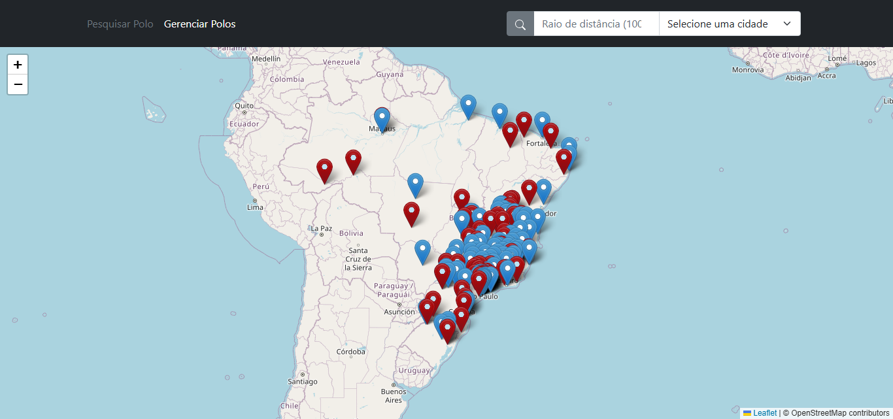

# 📌 Polos Search

🇷🇷 Aplicação web para localizar polos educacionais com base na cidade pesquisada. Exibe a distância até o centro urbano e mostra informações detalhadas do polo. Permite adicionar, editar e excluir polos de forma simples pela interface.
🇺🇸 Web application to locate educational hubs based on the searched city. It shows the distance from the city center and detailed information about each hub. Users can easily add, edit, and delete hubs through the interface.

---

## 📸 Demonstração / Demo



---

## 🚀 Tecnologias / Technologies

* JavaScript, HTML & CSS
* PostgreSQL + PostGIS
* Express.js
* Apache2
* Docker & Docker Compose
* Bootstrap
* [Leaflet.js](https://leafletjs.com/)
* [IBGE API](https://servicodados.ibge.gov.br/api/docs/)
* [OpenStreetMap Nominatim API](https://nominatim.org/release-docs/latest/api/Overview/)

---

## ⚙️ Funcionalidades / Features

### 🇷🇷 Funcionalidades

* Buscar polos por cidade
* Calcular distância do centro urbano
* Exibir polos em mapa interativo
* Adicionar, editar e excluir polos

### 🇺🇸 Features

* Search hubs by city
* Calculate distance from city center
* Display hubs on an interactive map
* Add, edit, and delete hubs

---

## ✅ Pré-requisitos / Prerequisites

* [Node.js (v18+)](https://nodejs.org/)
* [PostgreSQL (v13+)](https://www.postgresql.org/) com extensão [PostGIS](https://postgis.net/) habilitada
* [Docker](https://www.docker.com/)
* [Docker Compose](https://docs.docker.com/compose/)
* [Apache2](https://httpd.apache.org/)
* Git
* SO Linux 🐧 (Ubuntu Server 22.04 LTS recomendado)

---

## 📁 Como usar / How to Use

### 🔍 Pesquisando Polos / Searching Hubs

🇷🇷

1. Use o campo **"Selecione uma cidade"** para buscar a cidade desejada.
2. Pressione **Enter** ou clique no botão à esquerda do campo de busca.
3. Os polos serão exibidos no mapa com suas respectivas informações.

🇺🇸

1. Use the **"Select a city"** field to search for the desired location.
2. Press **Enter** or click the button to the left of the search field.
3. The hubs will appear on the map with their respective information.

### 🛠️ Gerenciando Polos / Managing Hubs

🇷🇷

1. Acesse a aba **"Gerenciar Polos"** no topo da página.
2. Visualize todos os polos cadastrados.
3. No canto superior direito, é possível buscar ou adicionar novos polos.
4. Cada card possui botões para **editar** ou **excluir** o polo.

🇺🇸

1. Navigate to the **"Manage Hubs"** tab at the top of the page.
2. View all registered hubs.
3. Use the top-right controls to search or add new hubs.
4. Each hub card has buttons to **edit** or **delete** the hub.

---

## 📦 Instalação / Installation

### 🌐 Frontend (Apache2)

```bash
git clone https://github.com/And5reas/PolosSearch
cd PolosSearch
mv ./frontend /var/www
```

Crie um novo virtual host:

```bash
cp /etc/apache2/sites-available/000-default.conf /etc/apache2/sites-available/frontend.conf
nano /etc/apache2/sites-available/frontend.conf
```

Exemplo de conteúdo (`<SeuEmail>` e `<Domínio>` devem ser ajustados):

```apacheconf
<VirtualHost *:80>
  ServerAdmin <SeuEmail>
  DocumentRoot /var/www/frontend
  ServerName <Domínio>

  ErrorLog ${APACHE_LOG_DIR}/error.log
  CustomLog ${APACHE_LOG_DIR}/access.log combined
</VirtualHost>
```

Ative o site:

```bash
a2ensite frontend.conf
systemctl reload apache2
```

Caso não funcione diretamente, mova a pasta `frontend` para `/var/www/html` e acesse via `http://<IP-do-servidor>/frontend`.

---

### 🧹 Backend (Docker)

```bash
cd PolosSearch/backend
npm install
touch .env
```

Exemplo de `.env`:

```dotenv
PGHOST=<ip-do-seu-banco>
PGUSER=<user>
PGPASSWORD=<password>
PGDATABASE=<database>
PGPORT=<port>
PORT=3000
```

Exemplo de `docker-compose.yml`:

```yaml
services:
  nodeapi:
    build: .
    container_name: nodeapi
    ports:
      - "3000:3000"
    environment:
      PGHOST: <host>
      PGUSER: <user>
      PGPASSWORD: <password>
      PGDATABASE: <database>
      PGPORT: <port>
      PORT: 3000
    volumes:
      - .:/app
    working_dir: /app
    command: sh -c "npm install && node index.js"
```

Crie e execute o container:

```bash
docker build -t geo-api .
docker run -it --rm -p 3000:3000 -v $PWD:/app geo-api
```

---

### 📃 Banco de Dados

As instruções completas de criação de tabelas, funções e triggers estão disponíveis na seção abaixo. Certifique-se de que o PostGIS está habilitado e o banco de dados `geodados` foi criado.

<details>
  <summary><strong>📄 SQL completo (clique para expandir)</strong></summary>

```sql
CREATE DATABASE geodados;

CREATE TABLE enderecos (
    id SERIAL PRIMARY KEY,
    nome TEXT NOT NULL,
    status CHAR(1) NOT NULL,
    mantenedor TEXT,
    endereco TEXT,
    cep VARCHAR(20),
    cidade TEXT,
    estado CHAR(2),
    qt_alunos INT,
    razao_social TEXT,
    latitude DOUBLE PRECISION NOT NULL,
    longitude DOUBLE PRECISION NOT NULL,
    geom GEOGRAPHY(Point, 4326) -- Usa tipo geográfico para suportar distâncias em metros
);

CREATE TABLE enderecos_deletados (
    id SERIAL PRIMARY KEY,
    nome TEXT NOT NULL,
    status CHAR(1) NOT NULL,
    mantenedor TEXT,
    endereco TEXT,
    cep VARCHAR(20),
    cidade TEXT,
    estado CHAR(2),
    qt_alunos INT,
    razao_social TEXT,
    latitude DOUBLE PRECISION NOT NULL,
    longitude DOUBLE PRECISION NOT NULL,
    geom GEOGRAPHY(Point, 4326), -- Usa tipo geográfico para suportar distâncias em metros
    deletado_em TIMESTAMP DEFAULT CURRENT_TIMESTAMP
);

CREATE OR REPLACE FUNCTION enderecos_proximos_geojson(
    lon DOUBLE PRECISION,
    lat DOUBLE PRECISION,
    raio_metros DOUBLE PRECISION DEFAULT 50000
)
RETURNS TEXT
AS $$
BEGIN
  RETURN (
    SELECT jsonb_build_object(
      'type', 'FeatureCollection',
      'features', jsonb_agg(
        jsonb_build_object(
          'type', 'Feature',
          'geometry', ST_AsGeoJSON(geom)::jsonb,
          'properties', jsonb_build_object(
            'id', id,
            'nome', nome,
            'status', status,
            'mantenedor', mantenedor,
            'endereco', endereco,
            'cep', cep,
            'cidade', cidade,
            'estado', estado,
            'qt_alunos', qt_alunos,
            'latitude', latitude,
            'longitude', longitude,
            'distancia', ROUND(
              ST_Distance(geom, ST_SetSRID(ST_MakePoint(lon, lat), 4326)::geography)
            )
          )
        )
      )
    )::text
    FROM enderecos
    WHERE ST_DWithin(
      geom,
      ST_SetSRID(ST_MakePoint(lon, lat), 4326)::geography,
      raio_metros
    )
  );
END;
$$ LANGUAGE plpgsql;

CREATE OR REPLACE FUNCTION enderecos_geojson()
RETURNS TEXT
AS $$
BEGIN
  RETURN (
    SELECT jsonb_build_object(
      'type', 'FeatureCollection',
      'features', jsonb_agg(
        jsonb_build_object(
          'type', 'Feature',
          'geometry', ST_AsGeoJSON(geom)::jsonb,
          'properties', jsonb_build_object(
            'id', id,
            'nome', nome,
            'status', status,
            'mantenedor', mantenedor,
            'endereco', endereco,
            'cep', cep,
            'cidade', cidade,
            'estado', estado,
            'qt_alunos', qt_alunos,
            'latitude', latitude,
            'longitude', longitude
          )
        )
      )
    )::text
    FROM enderecos
  );
END;
$$ LANGUAGE plpgsql;

CREATE OR REPLACE FUNCTION enderecos_proximos_polo(
  id_polo INT,
  raio_metros DOUBLE PRECISION DEFAULT 50000
)
RETURNS TEXT
AS $$
DECLARE
  geom_polo GEOGRAPHY;
BEGIN
  -- Obtém a geometria do polo informado
  SELECT geom::geography INTO geom_polo
  FROM enderecos
  WHERE id = id_polo
  LIMIT 1;

  IF geom_polo IS NULL THEN
      RAISE EXCEPTION 'Polo com ID "%" não encontrado.', id_polo;
  END IF;

  -- Retorna os endereços próximos em formato GeoJSON
  RETURN (
    SELECT jsonb_build_object(
    'type', 'FeatureCollection',
    'features', jsonb_agg(
        jsonb_build_object(
          'type', 'Feature',
          'geometry', ST_AsGeoJSON(e.geom)::jsonb,
          'properties', jsonb_build_object(
            'id', e.id,
            'nome', e.nome,
            'status', e.status,
            'mantenedor', e.mantenedor,
            'endereco', e.endereco,
            'cep', e.cep,
            'cidade', e.cidade,
            'estado', e.estado,
            'qt_alunos', e.qt_alunos,
            'latitude', e.latitude,
            'longitude', e.longitude,
            'distancia', ROUND(ST_Distance(e.geom::geography, geom_polo))
          )
        )
      )
    )::text
    FROM enderecos e
    WHERE ST_DWithin(e.geom::geography, geom_polo, raio_metros)
  );
END;
$$ LANGUAGE plpgsql;

CREATE OR REPLACE FUNCTION backup_before_delete_polo()
RETURNS TRIGGER AS $$
BEGIN
    -- Insere os dados deletados na tabela de backup
    INSERT INTO enderecos_deletados (nome, status, mantenedor, endereco , cep, cidade, estado, qt_alunos, razao_social, latitude , longitude, geom)
    VALUES (OLD.nome, OLD.status, OLD.mantenedor, OLD.endereco, OLD.cep, OLD.cidade, OLD.estado, OLD.qt_alunos, OLD.razao_social, OLD.latitude, OLD.longitude, OLD.geom);

    RETURN OLD;
END;
$$ LANGUAGE plpgsql;

CREATE OR REPLACE FUNCTION adicionar_endereco(
    end_nome TEXT,
    end_status CHAR(1),
    end_mantenedor TEXT,
    end_endereco TEXT,
    end_cep VARCHAR(20),
    end_cidade TEXT,
    end_estado CHAR(2),
    end_qt_alunos INT,
    end_razao_social TEXT,
    end_latitude DOUBLE PRECISION,
    end_longitude DOUBLE PRECISION
)
RETURNS TEXT AS $$
DECLARE
  linhas_afetadas INT;
BEGIN
  INSERT INTO enderecos (nome, status, mantenedor, endereco , cep, cidade, estado, qt_alunos, razao_social, latitude , longitude, geom)
  VALUES
  (end_nome, end_status, end_mantenedor, end_endereco, end_cep, end_cidade, end_estado, end_qt_alunos, end_razao_social, end_latitude, end_longitude, ST_SetSRID(ST_MakePoint(end_longitude, end_latitude), 4326)::geography);

  GET DIAGNOSTICS linhas_afetadas = ROW_COUNT;

  IF linhas_afetadas > 0 THEN
    RETURN 'Registro adicionado com sucesso.';
  ELSE
    RETURN 'Não foi possível adicionar o registro.';
  END IF;
END;
$$ LANGUAGE plpgsql;

CREATE OR REPLACE FUNCTION deletar_endereco(polo_id INT)
RETURNS TEXT AS $$
DECLARE
  linhas_afetadas INT;
BEGIN
  DELETE FROM enderecos WHERE id = polo_id;

  GET DIAGNOSTICS linhas_afetadas = ROW_COUNT;

  IF linhas_afetadas > 0 THEN
    RETURN 'Registro deletado com sucesso.';
  ELSE
    RETURN 'Registro não encontrado.';
  END IF;
END;
$$ LANGUAGE plpgsql;

CREATE OR REPLACE FUNCTION update_endereco(
    end_id INT,
    end_nome TEXT,
    end_status CHAR(1),
    end_mantenedor TEXT,
    end_endereco TEXT,
    end_cep VARCHAR(20),
    end_cidade TEXT,
    end_estado CHAR(2),
    end_qt_alunos INT,
    end_razao_social TEXT,
    end_latitude DOUBLE PRECISION,
    end_longitude DOUBLE PRECISION
)
RETURNS VOID AS $$
BEGIN
  UPDATE enderecos
  SET
    nome = end_nome,
    status = end_status,
    mantenedor = end_mantenedor,
    endereco = end_endereco,
    cep = end_cep,
    cidade = end_cidade,
    estado = end_estado,
    qt_alunos = end_qt_alunos,
    razao_social = end_razao_social,
    latitude = end_latitude,
    longitude = end_longitude,
    geom = ST_SetSRID(ST_MakePoint(end_longitude, end_latitude), 4326)::geography
  WHERE id = end_id;
END
$$ LANGUAGE plpgsql;

CREATE OR REPLACE TRIGGER trigger_backup_before_delete_polo
BEFORE DELETE ON enderecos
FOR EACH ROW
EXECUTE FUNCTION backup_before_delete_polo();`
```
</details>

---

## 📝 Licença / License

Este projeto está licenciado sob os termos da Licença MIT. Veja o arquivo [LICENSE](./LICENSE) para mais detalhes.

---

## 🤝 Contribuições / Contributions

Contribuições são bem-vindas! Em breve esta seção será atualizada com instruções específicas.

Contributions are welcome! This section will soon be updated with guidelines.

---

## 📬 Contato / Contact

Andreas William Porcel <br>
[And5reas.porcel@hotmail.com](mailto:And5reas.porcel@hotmail.com)<br>
[GitHub Profile](https://github.com/And5reas)<br>
[LinkedIn Profile](https://www.linkedin.com/in/andreas-william-porcel-832607298/)
